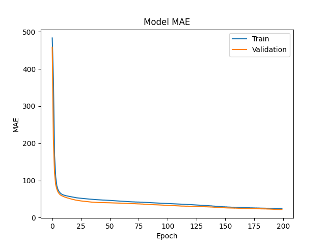
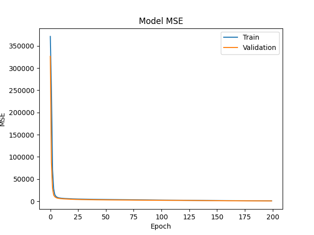
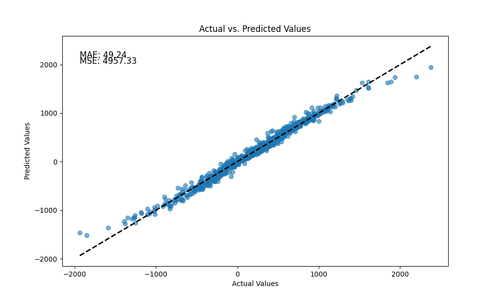

# Feedforward-Neural-Network-Regressor
本專案實作一個 **前饋式神經網路（Feedforward Neural Network, FNN）回歸系統**，  
針對給定的結構化資料進行訓練，並完成模型設計及推論、結果輸出與完整技術文件整理。

---

## 專案目標

- 建立一個前饋式神經網路（Feedforward Neural Network, FNN）進行連續數值預測
- 使用具連續型標註之資料集進行回歸模型訓練
- 對未知資料進行推論並輸出數值型回歸結果
- 將模型參數、訓練流程與實驗設定完整保存，以確保實驗可重現性

---

## 專案結構

```
.
├── regr_trn.csv            # 訓練資料集（最後一欄為類別標籤）
├── regr_tst.csv            # 測試資料集
├── regr_ans.csv            # 測試資料和預測分類結果
│
├── report2.h5               # 訓練完成的神經網路模型
│
├── train_Regessor.py      #  source code
└── README.md                # 專案說明文件
```

---

## 方法概述（Methodology）

### 資料處理
- 回歸目標值位於每筆資料的最後一個欄位
- 對訓練資料之輸入特徵進行標準化處理，以提升模型訓練穩定性與收斂速度
- 訓練資料與測試資料分開處理，並以訓練資料計算之標準化參數套用於測試資料，以避免資料洩漏

### 模型架構
- 模型類型：前饋式神經網路（Fully Connected Neural Network）
- 隱藏層：多層全連接（Dense）隱藏層
- 啟動函數：ReLU（應用於隱藏層）
- 輸出層：單一神經元，使用 Linear Activation 以進行連續數值回歸

### 訓練設定
- 損失函數：Mean Squared Error
- 最佳化方法：Adam Optimizer

---

## 使用方式（如有提供原始碼）

```bash
python train_Regessor.py
```

執行後將完成：
1. 載入並前處理訓練資料
2. 建立並訓練回歸模型
3. 使用測試資料進行推論
4. 輸出結果至 `regr1_ans.csv`
5. 儲存模型至 `regr1.h5`

---

## 輸出結果說明

### `regr1_ans.csv`
- 包含原始測試資料
- 以及模型對應的分類預測結果
- 每一列對應一筆測試樣本
### 1) 模型訓練的誤差（MAE)（Figure 1）


**說明：**
- 隨著 Epoch 增加，模型會反覆更新權重，以逐步降低誤差（MAE)

### 2) 均方誤差（MSE）（Figure 2）


**說明：**
- 模型透過反覆更新權重，使均方誤差（MSE）逐步降低

### 3) 模型預測結果（Figure 3）


---

## 環境需求

- Python 3.x
- TensorFlow / Keras
- NumPy
- Pandas

---
